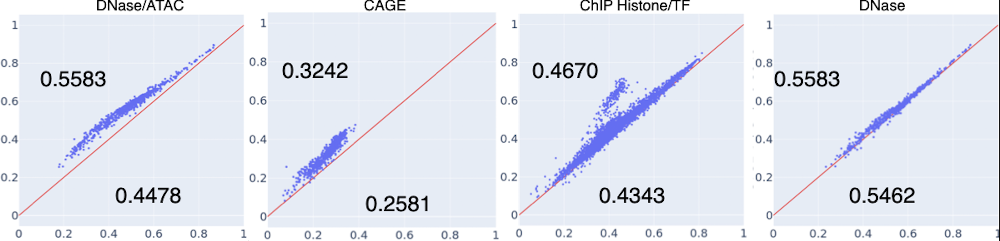

# 1D-Swin
The implementation of 1d-swin, an efficient transformer for capturing hierarchical 1-dimentional long range sequence. It is used for capturing sequences such as DNA, text, and audio.


# Install
## Install via pip

```bash
pip install git+https://github.com/Zehui127/1d-swin
```

## Install from source
  ```bash
  git clone https://github.com/Zehui127/1d-swin
  cd 1d-swin
  pip install -e .
  ```

# Demo
```python
from swin1d.module import swin_1d_block
from swin1d.examples import (
    random_text_generator,
    generate_random_dna,
    onehot_encoder,
)


def test_genomic_model(seq_length=512):
    """The input is a random DNA sequence generator, which generates a random
    DNA sequence with length of seq_length. The output is a tensor with shape
    of (batch_size, seq_length//block_num, hidden_size*block_num)."""

    input = generate_random_dna(seq_length)
    encode_input = onehot_encoder(input)
    model = swin1d_block(4)
    output = model(encode_input)
    print(output.shape)
    return output


def test_language_model(seq_length=512):
    """The input is a random text generator, which generates a random text with
    length of seq_length. The output is a tensor with shape of
    (batch_size, seq_length//block_num, input_token_size*block_num)."""

    input = random_text_generator(2, seq_length, tokenized=True)
    model = swin1d_block(1)
    output = model(input)
    print(output.shape)
    return output


def swin1d_block(dim):
    # stage = (number layers in each swin,
    #          whether to merge the ouput of each swin,
    #          window size)

    window_size = 32
    stages = [
        (
            4,
            True,
            window_size,
        ),
        (
            2,
            False,
            window_size,
        ),
        (
            2,
            False,
            window_size,
        ),
        (
            2,
            False,
            window_size,
        ),
    ]
    model = swin_1d_block(stages, dim)
    return model

```

# Result



# Cite This Project

```bibtex
@article{li2023genomic,
  title={Genomic Interpreter: A Hierarchical Genomic Deep Neural Network
         with 1D Shifted Window Transformer},
  author={Li, Zehui and
          Das, Akashaditya and
          Beardall, William AV and
          Zhao, Yiren and
          Stan, Guy-Bart},
  journal={arXiv preprint arXiv:2306.05143},
  year={2023}
}
```
